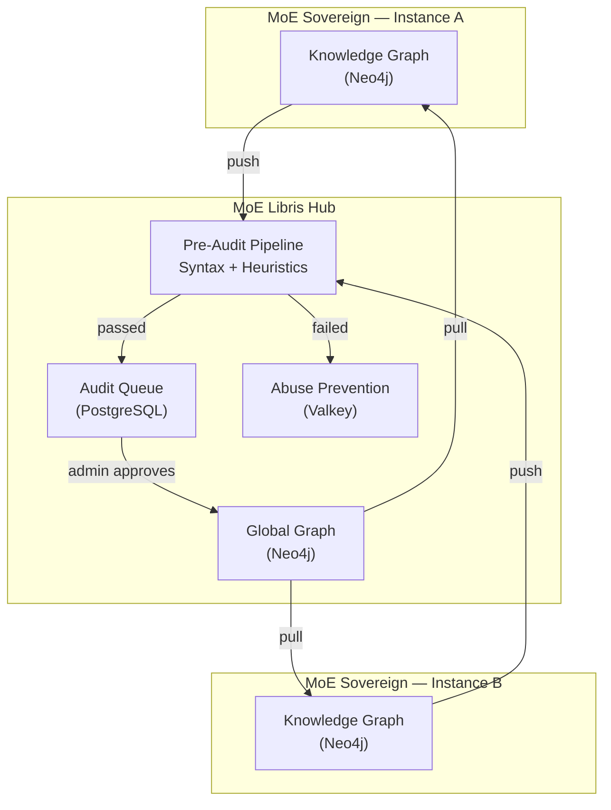

# MoE Libris

**Federated Knowledge Exchange Hub for MoE Sovereign Instances**

*Latin 'liber' = both 'free' and 'book' — freedom and knowledge in one word.*

[](LICENSE)
[](#stack)

MoE Libris is a lightweight federation server that enables secure, audited knowledge sharing between [MoE Sovereign](https://github.com/h3rb3rn/moe-sovereign) instances. Inspired by Fediverse architecture (ActivityPub/Friendica), it provides a hub-and-spoke model for exchanging knowledge graph triples via JSON-LD bundles — with full admin review before anything enters the shared graph.

---

## Architecture



## Features

- **Pre-Audit Pipeline** — Two-stage validation (syntax + heuristic PII/secret scanning) before anything enters the queue. LLM triage ready for v1.1.
- **Graduated Abuse Prevention** — Strike system with Valkey: 3 strikes → rate limit (1/hr), 10 weighted strikes → auto-block. Security violations count 3x.
- **Admin Audit Queue** — Every incoming bundle requires explicit admin approval before entering the global graph.
- **Global Knowledge Graph** — Approved triples stored in Neo4j with full provenance (origin node, approval timestamp).
- **Server Discovery** — Decentralized via [moe-libris-registry](https://github.com/moe-sovereign/moe-libris-registry) (public Git repo, anyone can register via PR).
- **Bilateral Handshake** — Nodes pair via handshake protocol with admin approval and bilateral API key exchange.
- **Instance Monitoring** — Track registered/active nodes, version distribution, and activity stats.

## Quick Start

```bash
cp .env.example .env
# Edit .env: set POSTGRES_PASSWORD, NEO4J_PASSWORD, LIBRIS_NODE_ID, LIBRIS_ADMIN_KEY

docker compose up -d

# API:  http://localhost:8080
# Docs: http://localhost:8080/docs
```

## API Reference

### Federation (Node-to-Node, requires `X-API-Key`)

| Method | Endpoint | Description |
|--------|----------|-------------|
| `POST` | `/v1/federation/push` | Push a JSON-LD knowledge bundle |
| `GET` | `/v1/federation/pull` | Pull approved knowledge (delta by `last_sync`) |
| `POST` | `/v1/federation/handshake` | Initiate node pairing |
| `POST` | `/v1/federation/confirm` | Confirm bilateral key exchange |
| `GET` | `/v1/federation/verify` | Registry verification (returns node ID + version) |

### Admin (requires `X-Admin-Key`)

| Method | Endpoint | Description |
|--------|----------|-------------|
| `GET` | `/v1/admin/audit/queue` | List audit queue (filter by status) |
| `GET` | `/v1/admin/audit/{id}` | Get full audit entry with bundle data |
| `POST` | `/v1/admin/audit/{id}/approve` | Approve and commit to global graph |
| `POST` | `/v1/admin/audit/{id}/reject` | Reject with reason |
| `GET` | `/v1/admin/nodes` | List all federation nodes (with version, activity) |
| `POST` | `/v1/admin/nodes/{id}/accept` | Accept handshake, generate API key |
| `POST` | `/v1/admin/nodes/{id}/reject` | Reject handshake |
| `POST` | `/v1/admin/nodes/{id}/block` | Block a node |
| `POST` | `/v1/admin/nodes/{id}/unblock` | Unblock and clear strikes |
| `GET` | `/v1/admin/registry` | List servers from moe-libris-registry |
| `POST` | `/v1/admin/registry/sync` | Force registry sync from GitHub |
| `GET` | `/v1/admin/stats` | Server stats (nodes, versions, graph, audits) |

### Health

| Method | Endpoint | Description |
|--------|----------|-------------|
| `GET` | `/` | Health check + instance info |
| `GET` | `/health` | Detailed health check |

## Configuration

| Variable | Default | Description |
|----------|---------|-------------|
| `DATABASE_URL` | — | PostgreSQL connection string |
| `NEO4J_URI` | `bolt://localhost:7687` | Neo4j Bolt URI |
| `NEO4J_USER` / `NEO4J_PASSWORD` | `neo4j` | Neo4j credentials |
| `VALKEY_URL` | `redis://localhost:6379/0` | Valkey/Redis URL |
| `LIBRIS_NODE_ID` | — | Unique ID for this hub instance |
| `LIBRIS_PUBLIC_URL` | — | Public URL (for registry verification) |
| `LIBRIS_ADMIN_KEY` | — | Admin API key |
| `REGISTRY_REPO_URL` | GitHub URL | Git repo for server discovery |
| `REGISTRY_SYNC_INTERVAL` | `3600` | Registry sync interval (seconds) |
| `STRIKE_SOFT_LIMIT` | `3` | Strikes before rate limiting |
| `STRIKE_HARD_LIMIT` | `10` | Weighted strikes before auto-block |
| `STRIKE_WINDOW_SECONDS` | `86400` | Strike sliding window (24h) |
| `LLM_TRIAGE_ENABLED` | `false` | Enable LLM-based content triage (v1.1) |

## Federation Protocol

### Handshake Flow

```
Node A                              Libris Hub
  │                                      │
  ├── POST /v1/federation/handshake ────►│  (Admin sees pending node)
  │   {node_id, url, name, domains}      │
  │                                      │  Admin clicks "Accept"
  │◄──── 200 {status: "pending"} ────────│
  │                                      │  Hub fetches Node A's /verify
  │                                      │  Hub generates API key for A
  │                                      │
  │  (Admin shares API key out-of-band)  │
  │                                      │
  ├── POST /v1/federation/confirm ──────►│  (with received API key)
  │   {api_key_for_you}                  │
  │                                      │
  │◄═══════ Sync Active ═══════════════►│
```

### Push/Pull Cycle

1. **Push**: Node exports knowledge → policy filter → pre-audit → audit queue → admin approval → global graph
2. **Pull**: Node requests `GET /pull?last_sync=<timestamp>` → receives approved triples since last sync → imports with trust floor

### Trust Model

- No automatic trust — every bundle requires admin approval
- Imported triples are capped at configurable trust floor (default 0.5)
- Contradiction detection prevents conflicting knowledge from entering
- Privacy scrubber removes PII, secrets, and internal identifiers before push

## Security

### Pre-Audit Pipeline

| Stage | Action | Failure |
|-------|--------|---------|
| **1. Syntax** | JSON-LD schema validation, field length limits, confidence range | Reject + syntax strike |
| **2. Heuristics** | Regex scan for emails, IPs, JWT tokens, API keys, private keys, phone numbers, AWS keys | Reject + security strike (3x weight) |
| **3. LLM Triage** | (v1.1) Content moderation via local LLM | Soft signal, not hard block |

### Abuse Prevention Tiers

| Tier | Trigger | Action |
|------|---------|--------|
| Normal | < 3 strikes | 60 pushes/hour |
| Rate Limited | ≥ 3 strikes | 1 push/hour |
| Auto-Blocked | ≥ 10 weighted strikes | HTTP 403, admin must unblock |

Security strikes (PII/secrets detected) count 3x. Strikes expire after 24 hours (sliding window).

## Stack

- **[FastAPI](https://fastapi.tiangolo.com/)** — Async Python web framework
- **[PostgreSQL 16](https://www.postgresql.org/)** — Audit queue, node registry, sync log
- **[Neo4j 5](https://neo4j.com/)** — Global approved knowledge graph
- **[Valkey 8](https://valkey.io/)** — Rate limiting, strike counters (Redis-compatible)

## Links

- **Main Project**: [github.com/h3rb3rn/moe-sovereign](https://github.com/h3rb3rn/moe-sovereign)
- **Documentation**: [docs.moe-sovereign.org](https://docs.moe-sovereign.org)
- **Server Registry**: [github.com/moe-sovereign/moe-libris-registry](https://github.com/moe-sovereign/moe-libris-registry)
- **Website**: [moe-sovereign.org](https://moe-sovereign.org)

## License

**[Apache License 2.0](LICENSE)**

---

<div align="center">
<sub>

*Latin 'liber' means both 'free' and 'book' — knowledge freely shared, sovereignty preserved.*

</sub>
</div>
