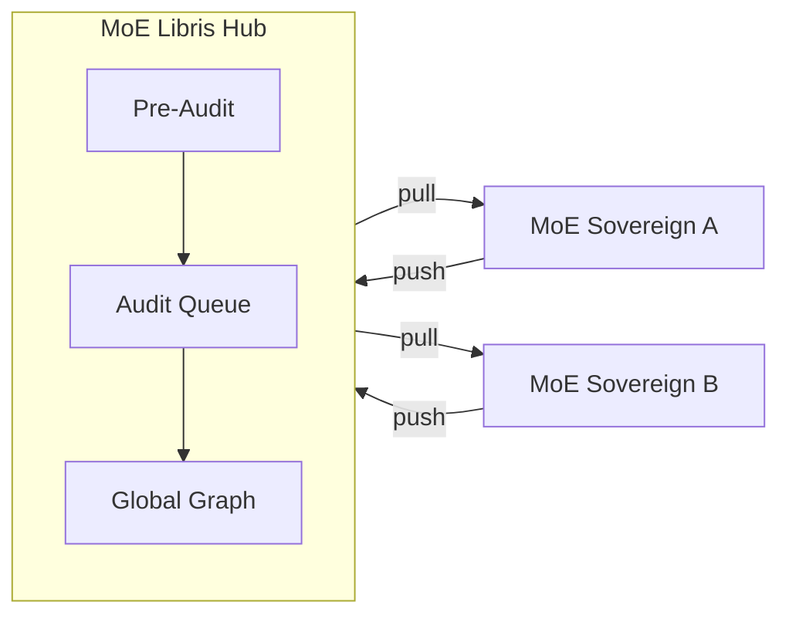

# MoE Libris

**Federated Knowledge Exchange Hub for [MoE Sovereign](https://github.com/h3rb3rn/moe-sovereign) instances.**

*Latin `liber` = free & book.*

[](LICENSE)
[](https://docs.moe-sovereign.org/federation/)
[](https://moe-libris.org)

Sovereign AI instances can push knowledge to a Libris hub, which audits and queues it for human review before approved triples become available for federated pull. Inspired by [Fediverse](https://en.wikipedia.org/wiki/Fediverse) architecture — voluntary participation, bilateral trust, no forced assimilation.

---

## Quick Start

```bash
cp .env.example .env
# Edit: POSTGRES_PASSWORD, NEO4J_PASSWORD, LIBRIS_NODE_ID, LIBRIS_ADMIN_KEY

docker compose up -d

# API:  http://localhost:8080
# Docs: http://localhost:8080/docs  (interactive OpenAPI)
```

## Architecture



**Security model:** Knowledge bundles are transmitted over mTLS (encrypted in transit).
There is no end-to-end encryption — the Hub's Pre-Audit pipeline inspects the JSON-LD
payload content, and a human Admin reviews bundles in the Audit Queue before graph merge.
Privacy protection is handled at the *sender node* via the
[Privacy Scrubber](https://docs.moe-sovereign.org/federation/trust/#privacy-scrubber)
before the bundle ever leaves the originating instance.

## Stack

FastAPI · PostgreSQL · Neo4j · Valkey · Docker

## Tests

```bash
pytest tests/   # 43 tests: security, pre-audit, abuse prevention
```

---

## Documentation

Full documentation at **[docs.moe-sovereign.org/federation](https://docs.moe-sovereign.org/federation/)**:

- **[Setup Guide](https://docs.moe-sovereign.org/federation/setup/)** — Configure a MoE Sovereign instance as a federation node
- **[Protocol](https://docs.moe-sovereign.org/federation/protocol/)** — Handshake, push/pull, JSON-LD bundle format, hub-to-hub topology
- **[Trust & Security](https://docs.moe-sovereign.org/federation/trust/)** — Pre-audit pipeline, abuse prevention, trust floor, contradiction detection
- **[Server Discovery](https://docs.moe-sovereign.org/federation/registry/)** — Public Git registry ([moe-libris-registry](https://github.com/moe-sovereign/moe-libris-registry))

## Links

- **Main Project** — [github.com/h3rb3rn/moe-sovereign](https://github.com/h3rb3rn/moe-sovereign)
- **Project Website** — [moe-libris.org](https://moe-libris.org)
- **Server Registry** — [moe-libris-registry](https://github.com/moe-sovereign/moe-libris-registry)

## License

[Apache License 2.0](LICENSE)
